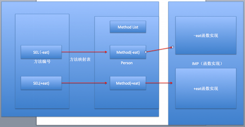

# runtime笔记

## 一、runtime简介
 - runTime简称运行时。OC就是`运行时机制`，也就是在运行时候的一些机制，其中最主要的是消息机制。
 - 对于C语言，`函数的调用在编译的时候会决定调用哪个函数`。
 - 对于OC的函数，属于`动态调用过程`，在编译的时候并不能决定真正调用哪个函数，只有在真正运行的时候才会根据函数的名称找到对应的函数来调用。
 - 事实证明：
	*	在编译阶段，OC可以`调用任何函数`，即使这个函数并未实现，只要声明过就不会报错。
	*	在编译阶段，C语言调用`未实现的函数`就会报错。

## 二、runtime作用

### 1.发送消息（消息机制）
- 方法调用的本质，就是向对象发送消息(底层调用objc_msgSend系列函数)。(2中调用方式，对象方法、类方法)
	* 对象方法：对实例对象发送消息
	* 类方法：  对所属的类对象发送消息
- objc_msgSend,只有对象才能发送消息，因此以objc开头.（即使是对象的私有方法也能通过这个函数调用到）
- 使用`消息机制`前提，必须导入#import <objc/message.h>
- 消息机制简单使用
	
	```objc
	// 对象方法调用
    Person *p = [[Person alloc] init];
    objc_msgSend(p, @selector(eat));
    objc_msgSend(p, @selector(run:), 10);
    
    // 类方法调用
    Class pClass = [Person class];
    objc_msgSend(pClass, @selector(eat));
	```
	
- 消息机制原理:对象根据方法编号SEL去映射表查找对应的方法实现
	
	
- 深层概念解析
	- 参考博客：<http://www.cocoachina.com/ios/20141018/9960.html>
	- NSObject类：OC中对象的基类基本都是它，定义如下
	
	  ```objc
	  @interface NSObject <nsobject> {
	  		Class isa  OBJC_ISA_AVAILABILITY;
	  }</nsobject>
	  ```
	  
	- Class isa 可以理解为就是这个类的类对象，它的定义如下（objc_class.h）
	
		```objc
		typedef struct objc_class *Class;  
		
		struct objc_class {
		  Class isa; // 指向metaclass
		   
		  Class super_class ; // 指向其父类
		  const char *name ; // 类名
		  long version ; // 类的版本信息，初始化默认为0，可以通过runtime函数class_setVersion和class_getVersion进行修改、读取
		  long info; // 一些标识信息,如CLS_CLASS (0x1L) 表示该类为普通 class ，其中包含对象方法和成员变量;CLS_META (0x2L) 表示该类为 metaclass，其中包含类方法;
		  long instance_size ; // 该类的实例变量大小(包括从父类继承下来的实例变量);
		  struct objc_ivar_list *ivars; // 用于存储每个成员变量的地址
		  struct objc_method_list **methodLists ; // 与 info 的一些标志位有关,如CLS_CLASS (0x1L),则存储对象方法，如CLS_META (0x2L)，则存储类方法;
		  struct objc_cache *cache; // 指向最近使用的方法的指针，用于提升效率；
		  struct objc_protocol_list *protocols; // 存储该类遵守的协议
	    }
		```
		- Class isa: 只想metaclass，也就是静态的Class。一般一个Obj对象中的isa会指向普通的Class，这个Class存储普通成员变量和对象方法（`-`开头的方法）。普通Class中的isa指针指向静态Class，静态Class中存储static类型成员变量和类方法（“+”开头的方 法）。
		- Class super_class:指向父类，如果这个类是根类，则为NULL。
		- 子类父类关系图
			 
	
	-  Method: `methodLists `中存储的类型 （objc_class.h）
		
		```objc
		typedef struct objc_method *Method;
		
		typedef struct objc_ method {
			SEL method_name; // 方法名称
			char *method_types; // 该方法参数的类型
			IMP method_imp; // 方法的实现地址
		};
		```
		- IMP SEL的方法具体实现的函数指针地址， 也就是代码块地址
		- SEL 表示方法的名字（例如：eat, run: 等）, @selector(eat)这是生成一个SEL方法选择器。SEL其主要作用是快速的通过方法名字（eat）查找到对应方法的函数指针（IMP），然后调用其函数。SEL其本身是一个Int类型的一个地址，地址中存放着方法的名字。对于一个类中。每一个方法对应着一个SEL。所以iOS类中不能存在2个名称相同的方法，即使参数类型不同，因为SEL是根据方法名字生成的，相同的方法名称只能对应一个SEL。
		
	- 总结， 消息机制发送消息的过程
	
		首先，编译器将代码`[p eat];`转化为`objc_msgSend(p, @selector(eat));`，在`objc_msgSend`函数中。首先通过p的`isa`指针找到p对应的Class。在Class中先去cache中 通过SEL查找对应函数method（猜测cache中method列表是以SEL为key通过hash表来存储的，这样能提高函数查找速度），若 cache中未找到。再去methodList中查找，若methodlist中未找到，则取superClass中查找。若能找到，则将method加入到cache中，以方便下次查找，并通过method中的函数指针跳转到对应的函数中去执行。
		
	- 个人补充，通过这一些过程的学习我们可以发现，为什么在有些博客或者学习视频中强调如果能用类方法还是使用类方法，因为如果不是cache中存储的经常调用的方法，那么在调用的时候需要去methodList中寻找方法，首先obj的Class指向的是一个静态Class，存储的是类相关的，然后静态Class内部又有一个Class指针指向一个普通的Class存储的是对象相关的	
	